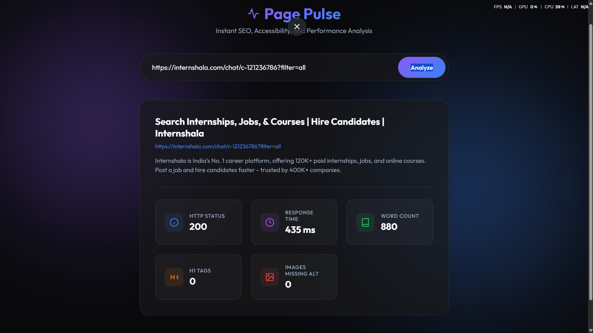
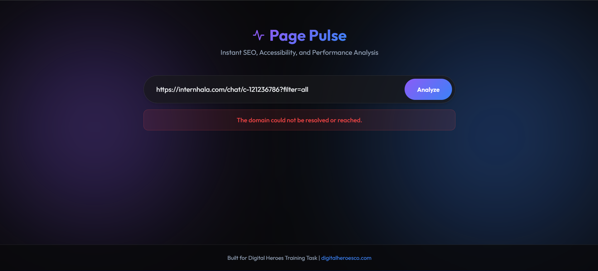

# Page Pulse

Page Pulse is a lightweight web application and backend API that analyzes any publicly accessible webpage and returns key SEO, accessibility, and content metrics.

The project was designed with a strong emphasis on reliability, clean architecture, testability, and graceful failure handling, mirroring the engineering practices used in production backend services.

## Project Goals

The objective of this project was not only to satisfy the assignment requirements, but also to demonstrate sound software engineering practices.

Key goals included:
- Clean separation of concerns
- Consistent API design
- Robust error handling
- Testability
- Maintainability
- Simple but polished user experience

---

## 📸 Screenshots

*(Add your images to the `screenshots/` folder, they will render here!)*

**Results View**


**Error State**


---

## 🏗️ Architecture

```text
Frontend
      │
      ▼
Controller
      │
      ▼
Analyzer Service
      │
      ├─────────────► URL Validation
      │
      ├─────────────► HTTP Fetch
      │
      ├─────────────► HTML Parser
      │
      ▼
Formatted JSON Response
```

## 🚀 Deployment & Tech Stack

- **Backend:** Node.js 20+ (Express, Cheerio)
- **Frontend:** Vanilla HTML/CSS/JavaScript
- **Testing:** Vitest, Supertest
- **Deployment:** Render (Backend), Vercel (Frontend)

---

## 📖 API Contract

**Endpoint:** `POST /api/analyze`

All responses follow the exact same response envelope.
```json
{
 "success": true,
 "data": { ... }, // or "error": { "code": "...", "message": "..." }
 "timestamp": "2026-07-24T18:42:10.513Z"
}
```

**Success Response (200 OK):**
```json
{
  "success": true,
  "data": {
    "url": "https://example.com",
    "httpStatus": 200,
    "responseTimeMs": 348,
    "title": "Example Domain",
    "metaDescription": "This domain is for use in illustrative examples in documents.",
    "h1Count": 1,
    "imagesMissingAlt": 0,
    "wordCount": 912
  },
  "timestamp": "2026-07-24T18:42:10.513Z"
}
```

---

## 🧠 Engineering Decisions & Trade-offs

### Why Cheerio instead of Puppeteer?
The assignment only requires parsing the initial HTML response. Cheerio is significantly faster, consumes far less memory, and avoids the startup overhead of launching a browser. Although Puppeteer supports JavaScript-rendered applications, that additional capability was unnecessary for the current scope and would have negatively impacted response time.

### Why Vanilla JavaScript?
The frontend requirements are intentionally small. Using vanilla HTML, CSS, and JavaScript removes unnecessary framework overhead, keeps the application lightweight, and allows the focus to remain on backend engineering and API design.

### Separation of Extraction and Analysis
I decoupled the HTML parsing logic (`htmlParser.service.js`) from the metric calculation logic (`analyzer.service.js`). The parser strictly extracts raw DOM elements, while the analyzer computes metrics like word count and missing alt tags. This keeps each component focused on a single responsibility and makes unit testing drastically easier.

### Standardized API Responses
Every endpoint returns a consistent response format containing a top-level `success` flag. This allows the frontend to handle responses uniformly without needing endpoint-specific parsing logic.

### Graceful Timeout Handling via AbortController
Rather than relying on third-party wrapper libraries, I used Node's native `fetch` alongside an `AbortController`. If a target website hangs indefinitely, the controller safely aborts the request and returns a `504 Gateway Timeout` instead of leaking memory or crashing the server.

### Robust URL Validation
Instead of relying on complex and brittle Regular Expressions to validate incoming URLs, the validation middleware uses Node's native `URL` constructor within a try/catch block to guarantee the URL is absolute and properly formatted.

### POST over GET for Analysis
Although analyzing a URL is idempotent, I chose `POST /api/analyze` over a `GET` request. This keeps potentially sensitive target URLs out of plaintext server access logs and makes the API easily extensible for complex configuration payloads in the future.

---

## 🧪 Testing

The project includes both unit and integration tests.

### Unit Tests
- HTML Parser
- Analyzer Service

### Integration Tests
- Successful URL analysis
- Invalid URL
- Request timeout
- Non-HTML response
- Domain not found

The goal of the tests is not simply coverage, but confidence that the API behaves consistently across expected and edge-case scenarios.

---

## 🔒 Security Considerations

Although this is an internship project, several production-oriented practices were considered:
- Request timeout protection
- Strict URL validation
- Content-Type verification
- Structured error responses (no stack trace leaking)
- Environment-based configuration

---

## 📌 Assumptions

This project makes the following assumptions:
- Target URLs are publicly accessible.
- Analysis is performed on the initial HTML response.
- Approximate word count is based on visible text only.
- External websites permit basic HTTP requests (no aggressive anti-bot protection).

---

## 💡 Reflection

If I had another day to work on this project, I would prioritize:
- Support JavaScript-rendered pages using Puppeteer.
- Add caching for repeated analyses.
- Improve accessibility of the frontend.
- Introduce request tracing and structured logging.

---

## 🤖 AI Usage Statement

AI was used primarily as an engineering assistant for brainstorming, reviewing architectural decisions, and identifying edge cases. Every implementation was manually written, tested, debugged, and refined before being included in the final submission.
